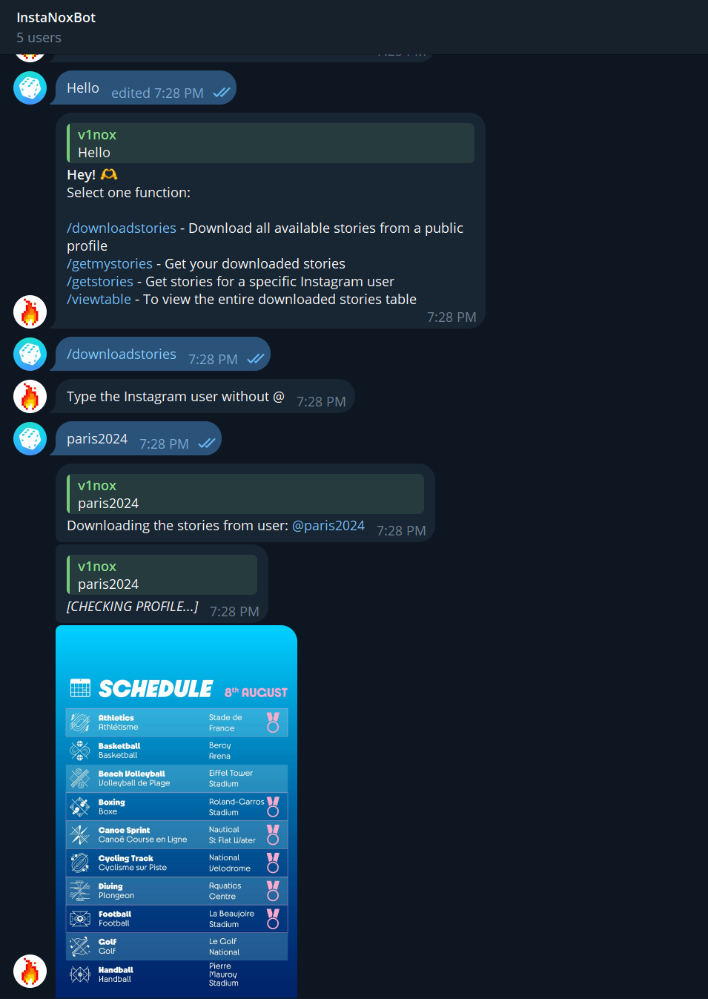
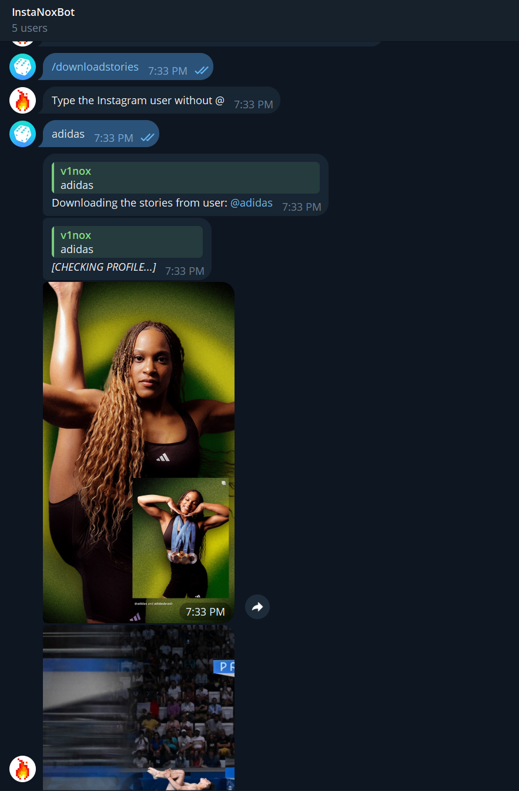
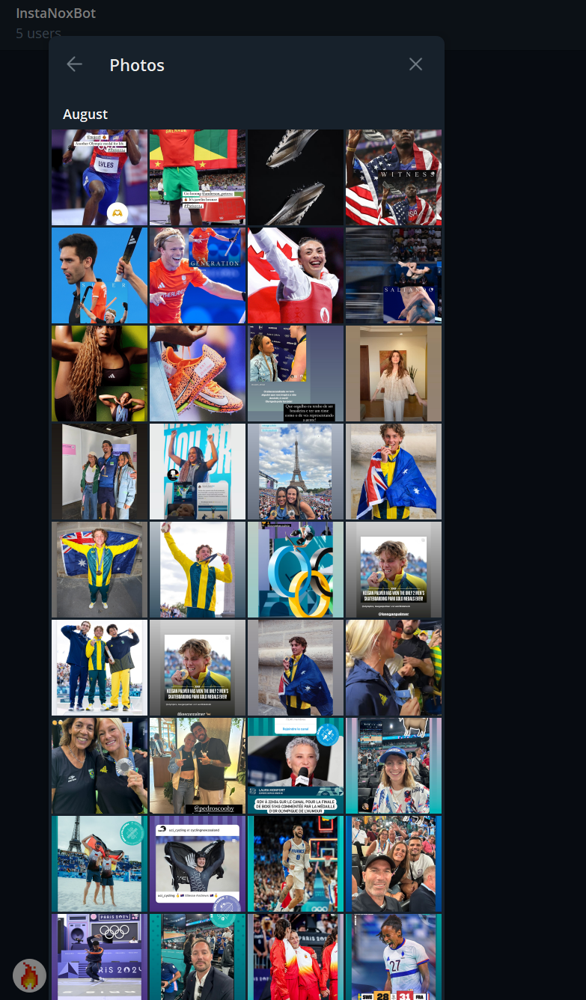
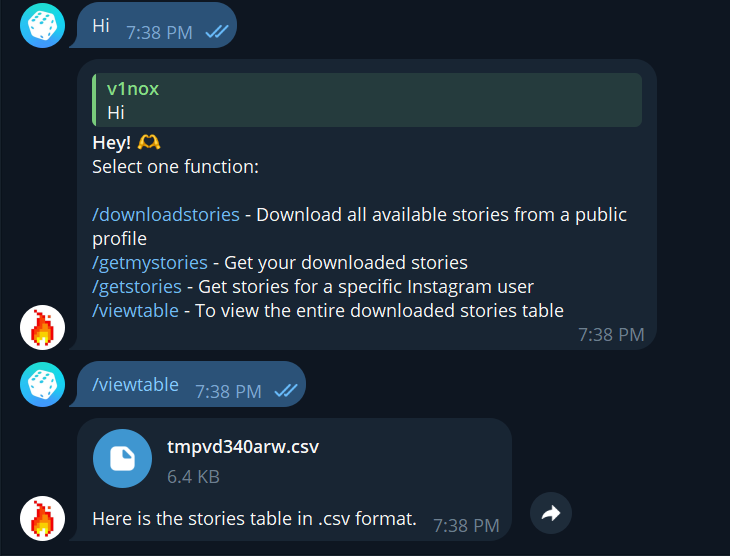
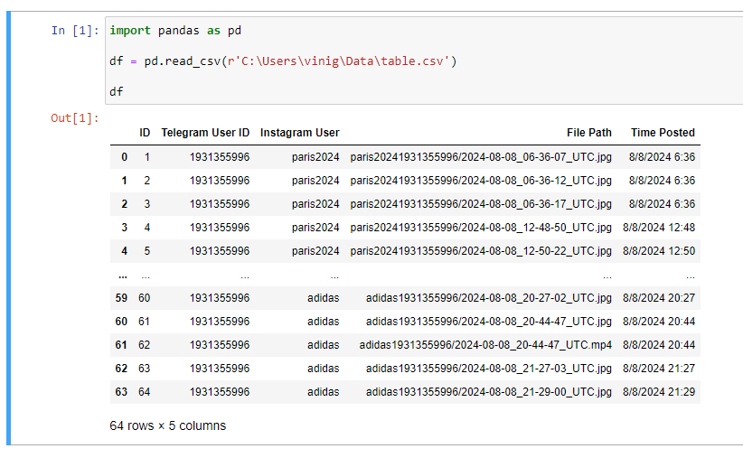

# Bot para baixar Stories do IG e salvar em um banco SQLite usando Telegram
- README em Português, clique aqui -> [](https://github.com/vin0x/ig-stories-telegram-db/blob/main/README-pt_br.md)

- README in English, click here -> [](https://github.com/vin0x/ig-stories-telegram-db/blob/main/README.md)

## Sobre

Este projeto é um bot do Telegram que faz download de stories do Instagram e os armazena em um banco de dados SQLite. Ele permite que os usuários baixem stories de perfis do Instagram, visualizem os stories baixados e exportem os dados como um arquivo CSV.

Utilizado durante os **Jogos Olímpicos de Paris 2024** para conectar fãs com os perfis de Instagram dos atletas e construir um banco de dados de seus momentos memoráveis, esta versão de exemplo do projeto usa um conjunto de dados menor para demonstrar os principais recursos com menor complexidade. Sinta-se à vontade para adaptar este bot às suas necessidades específicas de uso e pesquisa.

## Funcionalidades

- Baixar stories do Instagram de perfis públicos
- Visualizar stories baixados
- Recuperar stories por usuário do Instagram ou usuário do Telegram
- Stories salvos são armazenados em uma tabela SQLite
- Exportar dados de stories para um arquivo CSV

## Exemplo
  
  
  
  

Exemplo dos dados armazenados na tabela `stories.db` no SQLite, convertidos para .csv para envio via Telegram.
  

## Requisitos

- Python 3.x 🐍🐍
- Conta no Telegram
- Biblioteca `python-telegram-bot`
- Biblioteca `instaloader`
- Biblioteca `sqlite3` (incluída no Python)
- Biblioteca `pandas` (opcional para manipulação de dados usando arquivos .csv)

## Configuração

### 1. Clonar o Repositório

```bash
git clone https://github.com/vin0x/instagram-stories-downloader-bot.git
cd instagram-stories-downloader-bot
```

### 2. Instalar dependências

Garanta que você tem `pip` instalado, então rode o comando:

```bash
pip install python-telegram-bot instaloader pandas
```

### 3. Configurar o Bot

1. **Criar um Bot no Telegram**:
   - Use o [BotFather](https://core.telegram.org/bots#botfather) no Telegram para criar um novo bot e obter a chave da API.

2. **Criar um Arquivo de Sessão para o Instaloader**:
   - Use instaloader para fazer login e criar um arquivo de sessão ou faça login no Instagram usando o Firefox e execute o importfirefoxsession.py.
   - Execute instaloader --login seu_usuario e siga as instruções.
   - Salve o arquivo de sessão com o nome session-topcortessecos ou modifique o código para corresponder ao nome do seu arquivo de sessão.

### 4. Executar o Bot
Inicie o bot com:

```bash
python telegrambot.py
```

O bot agora estará em execução e aguardando comandos no Telegram.

## Comandos

- /downloadstories - Baixa todos os stories disponíveis de um usuário do Instagram. Digite o nome de usuário sem @.
- /getmystories - Recupera seus stories baixados.
- /getstories - Mostra stories de um usuário específico do Instagram. Digite o nome de usuário para buscar os stories.
- /viewtable - Visualize toda a tabela de stories como um arquivo CSV.

## Exportando para CSV

O comando /viewtable gera um arquivo CSV com as seguintes colunas:

- ID
- ID do Usuário do Telegram
- Usuário do Instagram
- Caminho do Arquivo
- Hora da Publicação
- País

O arquivo é enviado como um documento pelo Telegram.

## License

Este projeto está licenciado sob a Licença MIT. Veja o arquivo LICENSE para mais detalhes.

## Contact

Se você tiver alguma dúvida, entre em contato vinigoes@outlook.com ou vinox_quente no Discord.
