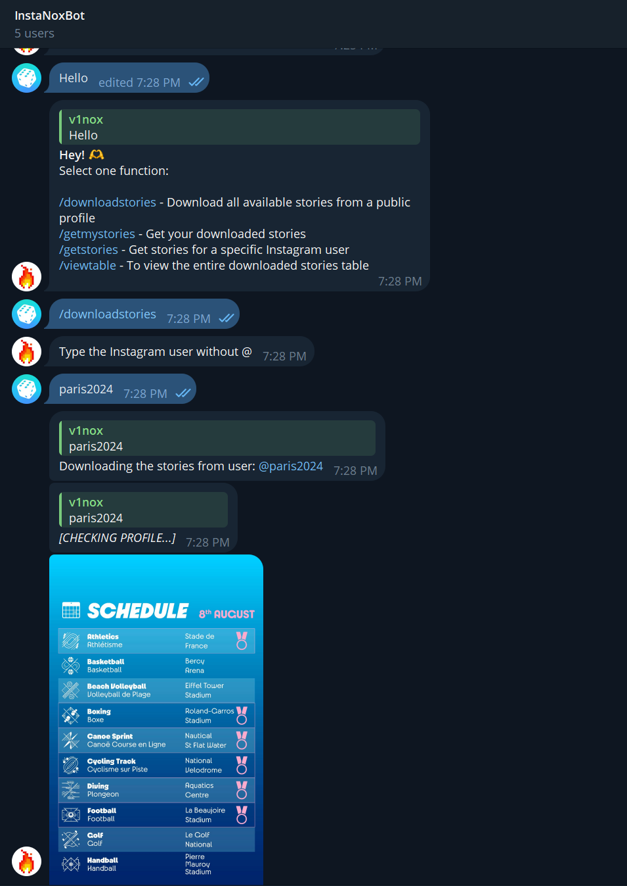
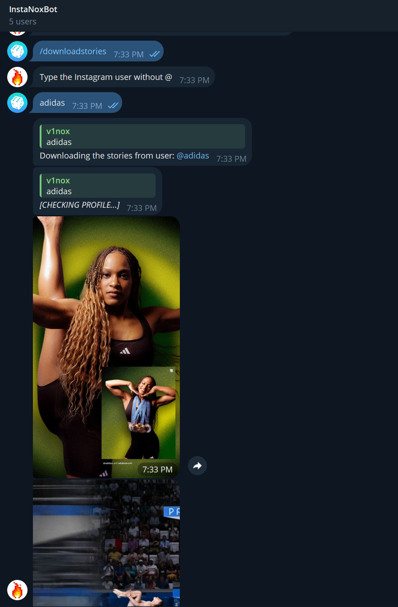
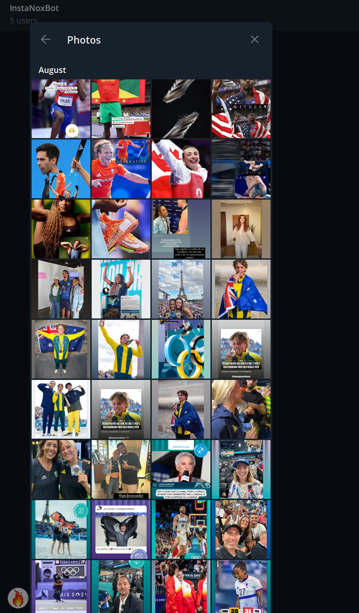
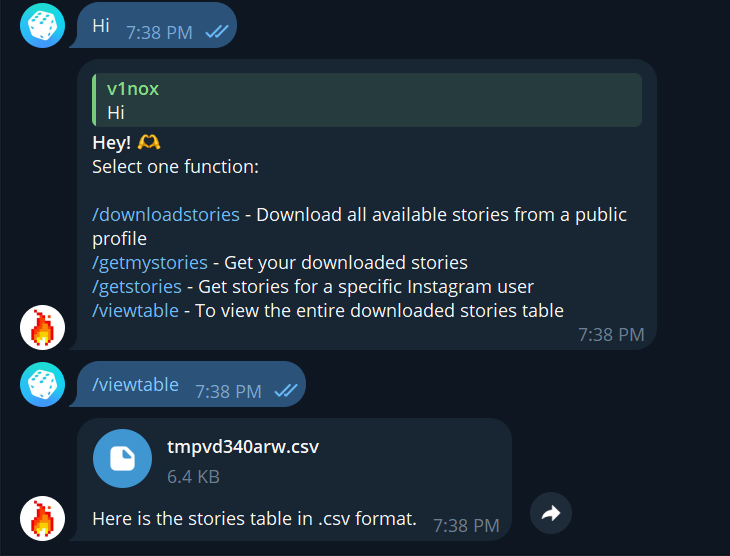
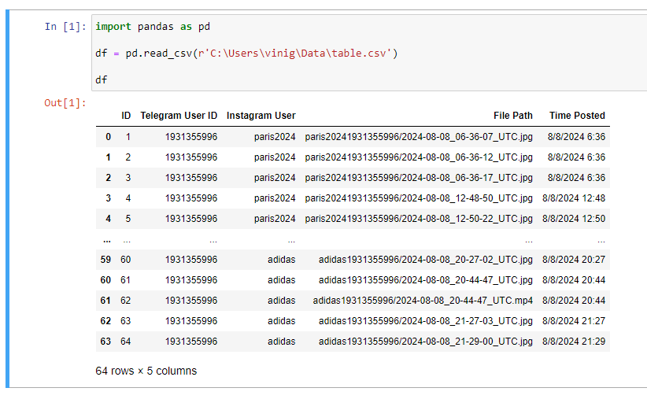

# Instagram Stories Downloader Bot

This project is a Telegram bot that downloads Instagram stories and stores them in a SQLite database. It allows users to download stories from Instagram profiles, view downloaded stories, and export the data as a CSV file.

_**PS:** This bot was used during the **Paris 2024 Olympic Games** to connect fans with athletes Instagram profiles and build a database of their memorable moments, this sample version of the project uses a smaller dataset to demonstrate key features with reduced complexity. Feel free to adapt this bot to suit your specific use case and research needs._

## Features

- Download Instagram stories from public profiles
- View downloaded stories
- Retrieve stories by Instagram user or Telegram user
- Saved histories are in a SQLite
- Export stories data to a CSV file

## Example
<div>
  
  
</div>
<div>
  
  
</div>
Example of the data that was stored in the stories.db table in SQLite, converted to .csv to be sent via Telegram.
  

## Requirements

- Python 3.x
- `python-telegram-bot` library
- `instaloader` library
- `sqlite3` library (included with Python)
- `pandas` library (optional for advanced data manipulation)

## Setup

### 1. Clone the Repository

```bash
git clone https://github.com/yourusername/instagram-stories-downloader-bot.git
cd instagram-stories-downloader-bot
```

### 2. Install Dependencies

Make sure you have `pip` installed, then run:

```bash
pip install python-telegram-bot instaloader pandas
```

### 3. Configure the Bot

1. **Create a Telegram Bot**:
   - Use [BotFather](https://core.telegram.org/bots#botfather) on Telegram to create a new bot and get the API key.
   - Replace the `api_key` in `bot.py` with your bot’s API key.

2. **Create a Session File for Instaloader**:
   - Use `instaloader` to log in and create a session file or log in Instagram using Firefox and run the `importfirefoxsession.py`.
   - Run `instaloader --login your_username` and follow the prompts.
   - Save the session file with the name `session-topcortessecos` or modify the code to match your session file name.

### 4. Run the Bot

Start the bot with:

```bash
python telegrambot.py
```

The bot will now be running and listening for commands on Telegram.

## Commands

- `/downloadstories` - Download all available stories from an Instagram user. Type the username without `@`.
- `/getmystories` - Retrieve your downloaded stories.
- `/getstories` - Get stories for a specific Instagram user. Type the username to fetch stories.
- `/viewtable` - View the entire stories table as a CSV file.

## CSV Export

The `/viewtable` command generates a CSV file with the following columns:

- `ID`
- `Telegram User ID`
- `Instagram User`
- `File Path`
- `Time Posted`
- `Country`

The file is sent as a document through Telegram.

## License

This project is licensed under the MIT License. See the [LICENSE](LICENSE) file for details.

## Contact

If you have any questions, feel free to reach out [vinigoes@outlook.com](mailto:vinigoes@outlook.com) or vinox_quente on Discord.
